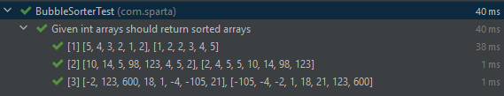
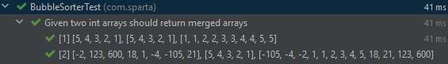

## Bubble Sort Task

### Requirements:

Write the code to take an array of ints and, using the bubble sort algorithm, return the array with its elements stored in ascending order.

### Extended task:

Take two sorted arrays as input and combine them into one sorted array. - Mergesort

---

## Creating the sorting method

The initial method should take an array of ints as its argument and return an array of ints.
```java
public int[] sort(int[] inputArray) {}
```
Bubble sort works by continuously comparing elements in a list and swapping them until it is certain the list is fully ordered.
For this to work in java we need a boolean. This boolean tells us if the list is sorted, it knows this because if the code manages
a clear pass through the array without making any swaps then it must be sorted.
```java
public int[] sort(int[] inputArray) {
    int arrayLen = inputArray.length;
    boolean isSorted = false;
}
```
_*I created the arrayLen int for legibility.\*_

For the continuous checking a while loop is appropriated, we can use the isSorted boolean as the condition for this while loop.
When the check starts it should be assumed that the array is sorted, this is so if the array is sorted the checks won't be made again.
```java
public int[] sort(int[] inputArray) {
        int arrayLen = inputArray.length;
        boolean isSorted = false;
        
        while (isSorted == false){
        isSorted=true;
        /// code for check down here
    }
}
```
To iterate through the array I used a for loop with the bounds of 0 & the input array length - 1. This is due to Java arrays indexing from 0 while length is a metric of how many elements are within an array.
```java
public int[] sort(int[] inputArray) {
    int arrayLen = inputArray.length;
    boolean isSorted = false;
        
    while (isSorted == false){
        isSorted=true;
        for (int i = 0; i < arrayLen - 1; i++) {}
        /// code for check down here
    }
}
```
The body of this for loop is what actually performs the comparisons between and reassignments of array values.
The comparison between the current value in the array and the next value in the array is done in an if statement.
For the case of sorting into numerical order the current value being larger than the next value will cause the comparison to be true and a swap to be made.

If a swap is made then the assumption we made about the list being sorted is false and the boolean isSorted should be updated to represent that.

```java
public int[] sort(int[] inputArray) {   
    int arrayLen = inputArray.length;    
    boolean isSorted = false;           

    while (isSorted == false) { 
    isSorted = true; 
        for (int i = 0; i < arrayLen - 1; i++) {
            if (inputArray[i] > inputArray[i + 1]) {
                int swapInt = inputArray[i]; 
                inputArray[i] = inputArray[i + 1]; 
                inputArray[i + 1] = swapInt; 
                isSorted = false;
            }
        }
    }
}
```

The final thing to do is to return the input array which now should be sorted.

```java
public int[] sort(int[] inputArray) {   
    int arrayLen = inputArray.length;    
    boolean isSorted = false;           

    while (isSorted == false) { 
    isSorted = true; 
        for (int i = 0; i < arrayLen - 1; i++) {
            if (inputArray[i] > inputArray[i + 1]) {
                int swapInt = inputArray[i]; 
                inputArray[i] = inputArray[i + 1]; 
                inputArray[i + 1] = swapInt; 
                isSorted = false;
            }
        }
    } 
    return inputArray;
}
```

To test this I used Parameterized tests and method source to stream arguments. For the tests, because the method check() returns int[]
I have used Arrays.toString to compare the contents of the output and the expected results. 

```java
class BubbleSorterTest {

    @ParameterizedTest
    @DisplayName("Given int arrays should return sorted arrays")
    @MethodSource("intArrays")
    void GivenIntArrays_BubbleSorterTest_ReturnsSortedArrays(int[] intArray, String expected){
        BubbleSorter bubbleSorter = new BubbleSorter();
        Assertions.assertEquals(Arrays.toString(bubbleSorter.sort(intArray)),expected);
    }

    private static Stream<Arguments> intArrays(){
        return Stream.of(
                Arguments.arguments(new int[] {5, 4, 3, 2, 1, 2}, Arrays.toString(new int[]{1, 2, 2, 3, 4, 5})),
                Arguments.arguments(new int[] {10, 14, 5, 98, 123, 4, 5, 2}, Arrays.toString(new int[]{2, 4, 5, 5, 10, 14, 98, 123})),
                Arguments.arguments(new int[] {-2, 123, 600, 18, 1, -4, -105, 21}, Arrays.toString(new int[]{-105, -4, -2, 1, 18, 21, 123, 600}))
        );
    }
}
```



Although this works it is terrible in terms of time complexity, bubble sort in the best case can only be optimised so far and this definitely isn't the best case.

For the extra task of merging two sorted arrays the simplest solution would be simply to brute force the whole thing by
copying all the values of both arrays into a new third array and then running the above sort method on this.

Code shown below
```java
public int[] mergeBrute(int[] inArray1, int[] inArray2){
    int[] outArray = new int[inArray1.length+inArray2.length];
    for(int i = 0; i<inArray1.length;i++ ){
        outArray[i] = inArray1[i];
    }
    int x = inArray1.length;
    for(int i = 0; i<inArray2.length;i++ ){
        outArray[x] = inArray2[i];
        x++;
    }
    return sort(outArray);
}
```


This works, sure, but the brute force method of combining and then just bubble sorting is again way too slow. Imagine trying to merge larger arrays, it would take ages.
There in lies the problem with bubble sort. In the best case it is as fast as the amount of elements in the arrays its accessing (O(n)) but averages its worst cases speeds of O(n^2).

No instead to merge arrays we need a new method entirely.

```java
public int[] merge(int[] inArray1, int[] inArray2) {

    int inArray1Length = inArray1.length;
    int inArray2Length = inArray2.length;

    int[] outArray = new int[inArray1Length + inArray2Length]; // Create new array of a size of the combined lengths of the input arrays

    int inArray1Position = 0; //initialise pointer variables
    int inArray2Position = 0;
    int mergedPosition = 0;

    while(inArray1Position < inArray1Length && inArray2Position < inArray2Length) { // While pointer 1 is still within first array and pointer 2 is still within second array
        if (inArray1[inArray1Position] < inArray2[inArray2Position]) { // Check pointer 1 is less than pointer 2
            outArray[mergedPosition++] = inArray1[inArray1Position++]; // Assign mergedPosition in outArray to the pointer 1 position from array 1, THEN add one to both the merged pointer and the array 1 pointer
        } else {
            outArray[mergedPosition++] = inArray2[inArray2Position++]; // else do the same assignment but using the pointer 2 position from array 2
        }
    }
    //These deal with out-of-bounds exceptions and then just add the remaining elements to the outArray, this works because once one array is empty the remaining values in the other array must be larger, so they can be added on the end
    while (inArray1Position < inArray1Length) {
        outArray[mergedPosition++] = inArray1[inArray1Position++];
    }

    while (inArray2Position < inArray2Length) {
        outArray[mergedPosition++] = inArray2[inArray2Position++];
    }

    return outArray;
}
```

This only works when sorted arrays are input but it is a lot faster than the brute force method. If you wanted to merge two or more unsorted lists
, then I would think the best thing to do would be to forget about bubble sort and use a faster sorting algorithm like bucket sort or radix sort then merge sort.