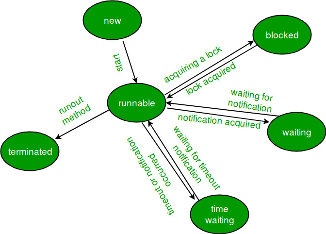

## Threads
- A single independent path of execution in the JVM.
- A Java program always starts with a single thread for execution: 
  - Initiated by the main method.

## Processes
- A self-contained execution environment.
- A thread is a lightweight process that requires fewer resources than creating a new process.

- Threads running in a process share the process' resources, including memory and open files.
  - The thread does have its own stack.

## Thread Management
- We have the Java Runtime System/Environment to manage threads, but it doesn't guarantee anything as the management is often
subcontracted to the underlying OS
- Threads run asynchronously and there does not have to be any communication between threads as they are self-contained.

    ### Thread Scheduler ¬
        
  - Can use this to recommend which threads should wait/run at which times

## Thread States

Threads at any point of time can exist in any ONE of the following states:
1. New
2. Runnable
3. Blocked
4. Waiting 
5. Timed Waiting
6. Terminated

#### New Thread: 
When a new thread is created, it is in the new state. The thread has not yet started to run when the thread is in this state. When a thread lies in the new state, its code is yet to be run and hasn’t started to execute.

#### Runnable State:
A thread that is ready to run is moved to a runnable state. In this state, a thread might actually be running, or it might be ready to run at any instant of time. It is the responsibility of the thread scheduler to give the thread, time to run.
A multithreaded program allocates a fixed amount of time to each individual thread.

Each and every thread runs for a short while and then pauses and relinquishes the CPU to another thread so that other threads can get a chance to run. When this happens, all such threads that are ready to run, waiting for the CPU and the currently running thread lie in a runnable state.
#### Blocked/Waiting state:
When a thread is temporarily inactive, then it’s in one of the following states:
- Blocked - The thread is trying to run but cannot continue due to a lock from a different thread.
- Waiting - The thread has been told to wait without a timeout parameter.

#### Timed Waiting:
A thread lies in a timed waiting state when it calls a method with a time-out parameter.
A thread lies in this state until the timeout is completed or until a notification is received. For example, when a thread calls sleep or a conditional wait, it is moved to a timed waiting state.

#### Terminated State:
A thread terminates because of either of the following reasons:
- Because it exits normally. This happens when the code of the thread has been entirely executed by the program.
- Because there occurred some unusual erroneous event, like segmentation fault or an unhandled exception.

Once in this terminated state the tread should be garbage collected as it is now considered out of scope.

## Liveness Issues

A concurrent application's ability to execute in a timely manner is known as its liveness.

## Locks

Locks are used in threads to deny access to resources to other threads while the resource is in use.

### The synchronized Keyword
When sharing resources between threads the __synchronized__ keyword must be used during method creation. This allows threads to know when the resources they need will be free
by notifying threads that a lock will be given up soon.

### The wait() method

When the wait() method is called on a thread holding the monitor lock, it surrenders the monitor lock and enters the waiting state.

### The notify() method

When the notify() method is called on a thread holding the monitor lock, it symbolizes that the thread is soon going to surrender the lock

## Deadlock, Livelock & Starvation

__Deadlock__ is when two more threads cause the program to hang by not giving up their resources to each other due to needing
both their resource and the other's resource to finish. This is known as denial of resource acquisition.

__Livelock__ is a deadlock-like situation in which processes block each other with a repeated state change yet make no progress.

__Starvation__ is the outcome of a deadlock, livelock, or as a result of continuous resource denial to a process.
When a thread tries to access a resource by obtaining its lock but if it can never obtain the lock then they starve themselves and other threads

## The Runnable Interface

- Runnable is a functional interface with 1 method run().
- Anything that implements runnable can be run in on a Thread

## Ways of making threads

Extending the Thread class
Implementing the Runnable interface

When we make an object of a thread we instantiate the object then .start
With runnable we have to provide a thread for the runnable to start on