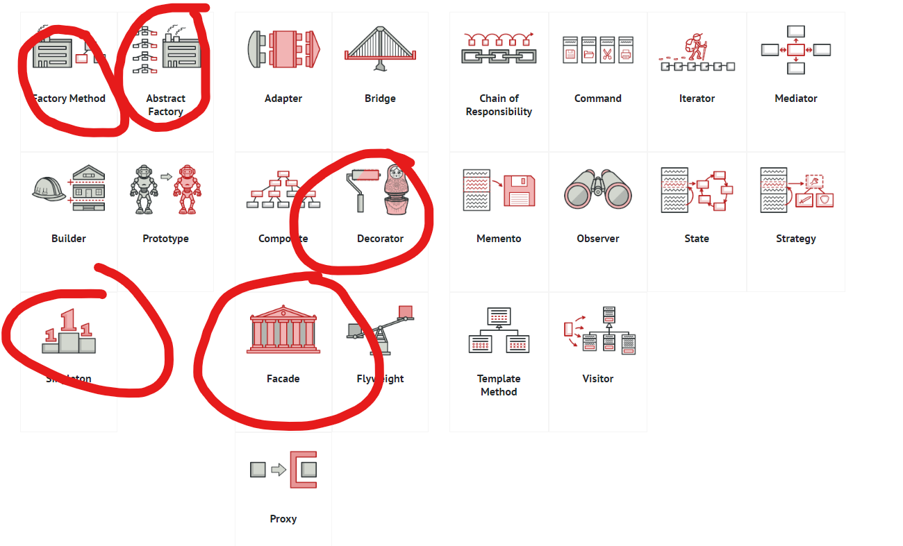

## What is a design pattern?
- A design pattern is an accepted solution for a common problem
- Each pattern is a template that can be customised to suit the unique problem you're faced with.

### Aggregation/composition is the key principle behind many design patterns.

#### Aggregation:
- Utilises a CONTAINS-A relationship
- Object A contains objects B; B can live without A.

#### Composition:
- Utilises a HAS-A relationship
- Object A consists of objects B; A manages life cycle of B; B can’t live without A.

---

### The 3 types of design patterns:

#### - Creational patterns
  - These patterns provide various object creation mechanisms which increase flexibility and reuse of existing code.
#### - Structural patterns
  - These patterns explain how to assemble objects and classes into larger structures while keeping these structures flexible and efficient.
  - Allows us to add new functionalities and abilities without affecting their existing behaviour.
#### - Behavioral patterns 
  - These patterns are concerned with algorithms and the assignment of responsibilities between objects.

---

## Important patterns
- Factory method
- Abstract factory method
- Singleton
- Decorator
- Facade

### Factory
- Creational design pattern that provides an interface for creating objects in a superclass, but allows subclasses to alter the type of objects that will be created.

### Abstract Factory
- Creational design pattern that lets you produce families of related objects without specifying their concrete classes.

### Singleton
- Creational design pattern (to be used in how we create objects)
- Lets you ensure that a class has only one instance while providing global access for this instance.
- Store the instance in a variable and use the variable like a getter method, also protects this instance by stopping the new keyword.
#### - Key features of singleton
  - Private Static reference to the object
  - Private constructor
  - Static getter with if statement

### Decorator
- Sometimes called the wrapper pattern

### Facade
- Structural design patter that provides a simplified library, a framework, or any other complex set of classes.

