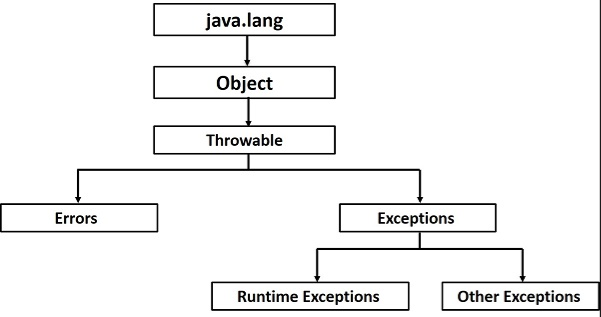

## Exceptions

Exceptions are not the same as errors, although both are usually unexpected exceptions can be anticipated and dealt with.
Exceptions occur during runtime and interrupt the flow of a program.

You can make your own exceptions - want to disrupt your own program's flow.

When an exception occurs at runtime, the normal flow of the program is disrupted, the exception is thrown and the program terminates.

Exception extends Throwable.



### Checked vs. Unchecked exceptions

Anything that inherits from runtime exceptions is an unchecked exceptions
Anything that extends directly from the Exception superclass is a checked exception except for the RuntimeException class

The difference between checked and unchecked is when they can be seen to be causing a problem.

Checked exceptions can be seen as issues before runtime time while unchecked exceptions can only be seen to cause issues during runtime.

#### Checked Exceptions
- Must abide by the "handle or declare" rules in Java
  - Must put code in try/catch blocks or use "throws" keyword
- These are "checked" at compile-time by the compiler
#### Unchecked Exceptions
- Any exception that extends RuntimeException class (any subclass)

#### Examples of checked and unchecked exceptions

**Unchecked**
- NullPointerException 
- ClassCastException 
- ArithmeticException 
- DateTimeException
- ArrayStoreException

**Checked**
- ClassNotFoundException
- SocketException
- SQLException
- IOException
- FileNotFoundException

---

## Dealing with exceptions

A common way of dealing with exceptions is a try catch finally block.
```java
try{
   //some code that might throw an exception
} catch (someException e){
    //do this if that exception happens
} finally {
    //this code will always run
}
//continue code with the exception now handled
```

If you don't do anything with the catch statement that's called "hiding the exception" and is awful.
The minimum is print the exception and terminate code block.

As long as you have a combination of at least one try and at least one of either a catch or finally statement then a try statement is valid.
So this is valid:
```java
try{
    //some code 
} finally {
    // some more code
}
```

You can use multiple catch statements but only one catch block will run for the try statement.
If you get multiple exceptions in the try block the first applicable catch will run and then the rest of the catch blocks will be skipped.

Should always have the more specific catch blocks above the less specific catch blocks.

You can have a single catch block catch multiple exceptions like so: (These are called "multi-catch" blocks)

```java
catch(someException | someOtherException e){/* some code*/ }
```
---

## Errors

An error is something we can't deal with in the same way as Exceptions.
(Can't use try and catch)

Can cause termination abnormally.
Can be more serious problems relating to JVM or memory usage.

Error extends Throwable.

Typically, we see compile time errors (the things with red underlines and highlighting),
runtime errors happen after we start running the program.

---

## Logging

We use Log4j2, we need the core and the api for this in our pom.xml file.
```xml
<dependencies>
    <dependency>
        <groupId>org.apache.logging.log4j</groupId>
        <artifactId>log4j-core</artifactId>
        <version>2.19.0</version>
    </dependency>
    <dependency>
        <groupId>org.apache.logging.log4j</groupId>
        <artifactId>log4j-api</artifactId>
        <version>2.19.0</version>
    </dependency>
</dependencies>
```

Logging is exactly what it says it is, it logs exceptions at different levels.

The log levels in log4j2 follow a hierarchy of severity and is as follows:
ALL < TRACE < DEBUG < INFO < WARN < ERROR < FATAL and OFF.

Setting the log level of a log file will have it log all errors and exceptions labeled with that level and up.

We use Logger class objects (normally static to the class we want to log about) and use the .log() function to declare the level of an issue of each logged message. 