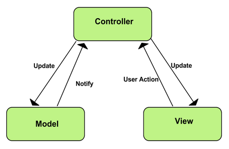

## Model View Controller/Communicator

The Model is completely separate from the view, it basic terms, the model doesn't know the view exists.

The Model is the main backend of an MVC system, it is where key operations take place and interacts solely with the controller.

The View is what the user interacts with, whether it be the console or gui. User actions are sent to the controller.

The Controller acts as a middle-man between the model and the view. It handles user inputs from the view, sends them to the model, receives new information from the model and returns this information to the view.

