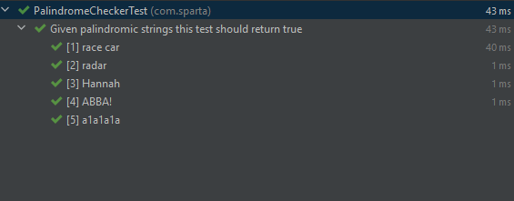
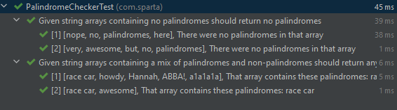

## Palindrome Checker Task

### Create a method that takes a String as parameter and returns whether that String is a palindrome.

Consider:
- Character case
- Full sentences with spaces and special characters
- Invalid inputs

Test and document your project
Upload to GitHub
Send your trainer an email with a link to your repository


Extra considerations:
- Taking a String array as input and returning all the palindromes in that array

---

### Documentation

I thought that the best idea for this task would be to create a class, PalindromeChecker, with its own methods rather than coding straight into the Main.java file.

## Creating the PalindromeChecker Class

For the PalindromeChecker to work it would need to take a string and then be able to reverse it. Being told beforehand that using String builder was not allowed
I thought that the best way to do this would be to create a Char array which I can iterate over.

The task also states to consider character case and special characters. I decided that my palindrome checker will simply ignore all special characters and cases.

```java
public class PalindromeChecker {
    
    public PalindromeChecker(){};
    
    public boolean check(String inputString) {
        boolean isPalindrome;
        String formattedInput = inputString.toLowerCase().replaceAll("[^a-z0-9]","");
        char[] inAsArray = formattedInput.toCharArray();  
        int start = 0;                                    
        int end =  inAsArray.length-1;
        char currentChar;
        while(end>start){
            currentChar = inAsArray[start];
            inAsArray[start] = inAsArray[end];
            inAsArray[end] = currentChar;
            end--; start++;
        }
        return (new String(inAsArray).equals(formattedInput));
    }
```

This is what I came up with after a bit of researching on how to reverse strings without using a StringBuilder.

You can see that this takes an input of type String and then formats this input.
The formatted input is converted to lowercase and then has all the non-alphanumeric characters and spaces removed/replaced by an empty string.

Then an array of chars is created from the formatted input.
I also created two int variables to act as pointers for when I iterate over the array and a char "currentChar" to act as a placeholder.

Using a while loop I iterate over this char array and reassign the chars using the values in the array at the pointer indexes and currentChar.

When the while loop ends a comparison is done between the formatted input text and a new String made up of the character in the reversed array.
The result of this comparison, a boolean, is then returned as the overall value of the check method.

This, I believe, meets the criteria for the task.

I tested with a parameterized test of palindromes, some containing special characters, different cases, spaces and numbers.
```java
class PalindromeCheckerTest {

    @ParameterizedTest
    @DisplayName("Given palindromic strings this test should return true")
    @ValueSource(strings = {"race car", "radar", "Hannah", "ABBA!", "a1a1a1a"})
    void GivenPalindromicStrings_PalindromeCheckerTest_ReturnsTrue(String strings) {
        PalindromeChecker palindromeChecker = new PalindromeChecker();
        boolean expected = true;
        boolean result = (palindromeChecker.check(strings));
        Assertions.assertEquals(expected, result);
    }
}
```


---
### The extra consideration

The extra task states that a String array should be able to be taken as input and that all the palindromes found in that array should be returned.

I thought that the best way to return all the palindromes in an array would just be as a formatted String that states what the method found,
but I could've made it return a new String array containing all the palindromes.

To meet the extra consideration I created a method with the same name but a new constructor that takes String[] as its argument.

```java
    public String check(String[] inputStringArray) {
        boolean containsPalindromes = false;
        String containedPalindromes = new String("That array contains these palindromes:");
        for(String s : inputStringArray){
            if(check(s)){
                containedPalindromes = containedPalindromes + (" " + s);
                containsPalindromes = true;
            }
        }
        if (containsPalindromes){
            return containedPalindromes;
        } else return "There were no palindromes in that array";
    }
```

For this new method I initialized a boolean, containsPalindromes, for an if statement I use later and I also create the start of the return string that will be used if there are any palindromes found in the array. I named this "containedPalindromes". 

Using a for loop I go through each string and call the original check method using said string.
Then, in the same iteration of the loop, I use an if statement to check whether the check() call came back true or false, (if it was a palindrome or not).

If it was a palindrome then I concatenate containedPalindromes, a space and the current string. At this point I reassign containsPalindromes to true as if the code gets here a palindrome must've been found.

When the for loop is finished an if statement is run to check the value of containsPalindromes. If true, the method will return a string "That array contains the palindromes: _**whatever palindromes where in the array**_".
If not, then the returned string will simply say "There were no palindromes in that array".

I tested this with again with parameterized tests using method source to pass arguments containing arrays.
```java
    @ParameterizedTest
    @DisplayName("Given string arrays containing a mix of palindromes and non-palindromes should return any palindromes")
    @MethodSource("StringArraysPalindromes")
    void GivenStringArraysContainingAMixOfPalindromesAndNonPalindromes_PalindromeCheckerTest_ReturnsAnyPalindromes(String[] stringArray, String expected){
        PalindromeChecker palindromeChecker = new PalindromeChecker();
        Assertions.assertEquals(palindromeChecker.check(stringArray),expected);
    }

    private static Stream<Arguments> StringArraysPalindromes(){
        return Stream.of(
                Arguments.arguments(new String[] {"race car","howdy","Hannah","ABBA!","a1a1a1a",}, "That array contains these palindromes: race car Hannah ABBA! a1a1a1a"),
                Arguments.arguments(new String[] {"race car","awesome"},"That array contains these palindromes: race car")
        );
    }

    @ParameterizedTest
    @DisplayName("Given string arrays containing no palindromes should return no palindromes")
    @MethodSource("StringArraysNoPalindromes")
    void GivenStringArraysContainingNoPalindromes_PalindromeCheckerTest_ReturnsNoPalindromes(String[] stringArray, String expected){
        PalindromeChecker palindromeChecker = new PalindromeChecker();
        Assertions.assertEquals(palindromeChecker.check(stringArray),expected);
    }

    private static Stream<Arguments> StringArraysNoPalindromes(){
        return Stream.of(
                Arguments.arguments(new String[] {"nope","no", "palindromes", "here"}, "There were no palindromes in that array"),
                Arguments.arguments(new String[] {"very","awesome","but","no","palindromes"},"There were no palindromes in that array")
        );
    }
```
