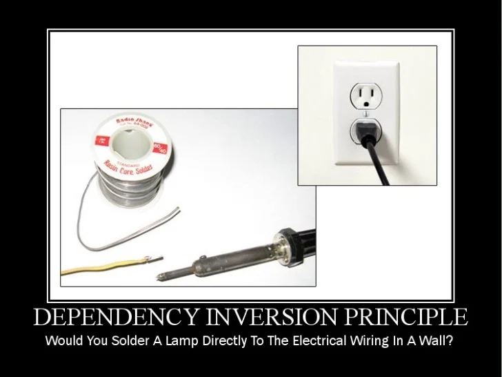

## SOLID Principles
### What are the SOLID Principles?
- Single **responsibility** principle - Class has one job to do. Each change in requirements can be done by changing just one class.
- **Open/closed** principle - Class is happy (open) to be used by others. Class is not happy (closed) to be changed by others.
- Liskov **substitution** principle - Class can be replaced by any of its children. Child classes inherit parent's behaviours.
- **Interface segregation** principle - When classes promise each other something they should separate these promises (interfaces) into many small promises, so it's easier to understand.
- **Dependency** inversion principle - When classes talk to each other in a very specific way, they both depend on each other to never change. Instead, classes should use promises (interfaces, parents), so classes can change as long as they keep the promise.

#### More on the SOLID Principles
- **Single Responsibility Principle**
  - "A class should only have one reason to change". Each Java class must perform a single functionality.


- **Open-Closed Principle**
  - Software entities (separate classes, modules, functions, etc.) should be open for extension but closed for modification.
  - For "good" code you shouldn't have to modify existing code in add functionality, instead you should extend functionality with new code.
    - Extension meaning that a software module can be extended to make it behave in new and different ways.
    - This is not limited just to the "extend" keyword but also polymorphism to invoke extended behaviours (things like new constructors etc.)
    - Closed for modification means that source code of a software module should remain unchanged.


- **Liskov Substitution Principle**
  - Derived classes must be completely substitutable for their base classes.
  - There should be no unusable abstract methods inherited from a base class or interface.

  - I.e. functions that use references to base classes must be able to use objects of the derived class without knowing it.


- **Interface Segregation Principle**
  - No code should be forced to depend on methods it does not use.
  - If this is the case in a subclass then this means that abstraction is needed.

  - I.e. Larger interfaces should be split into smaller ones. We don't want to force class to implement methods they don't need.


- **Dependency Inversion Principle**
  - High-level modules should not depend on low-level modules. Both should depend on abstractions.
  - Abstractions should not depend on details. Details should depend on abstractions.
  - A module is a distinct assembly of components within a program. It is a logical sub-set of the functionality provided by the whole program. A "Chunk of software"

| Letter |       Stands for       |
|:------:|:----------------------:|
|   S    | Single Responsibility  |
|   O    |      Open/Closed       |
|   L    |  Liskov Substitution   |
|   I    | Interface Segregation  |
|   D    |  Dependency Inversion  |

The interface segregation principle is sometimes called the "no fat interfaces" principle. Basically interfaces shouldn't be too big.

e.g. Class Bird, Interface flyingBird, Interface swimmingBird
```java
Class Penguin extends Bird implements swimmingBird
Class Robin extends Bird implements flyingBird
Class Duck extends Bird implements flyingBird and swimmingBird
```
### What's the difference between Class and Interface?

| CLASS                                                                                                | INTERFACE                                                                                                                                         |
|------------------------------------------------------------------------------------------------------|---------------------------------------------------------------------------------------------------------------------------------------------------|
| The ‘class’ keyword is used to create a class.                                                       | The ‘interface’ keyword is used to create an interface.                                                                                           |
| An object of a class can be created.                                                                 | An object of an interface cannot be created.                                                                                                      |
| Class doesn't support multiple inheritance.                                                          | Interface supports multiple inheritance.                                                                                                          |
| A class can inherit another class.                                                                   | An Interface cannot inherit a class.                                                                                                              |
| A class can be inherited by another class using the keyword ‘extends’.                               | An Interface can be inherited by a class using the keyword ‘implements’ and it can be inherited by another interface using the keyword ‘extends’. |
| A class can contain constructors.                                                                    | An Interface cannot contain constructors.                                                                                                         |
| It cannot contain abstract methods.                                                                  | It consists of abstract methods only.                                                                                                             |
| Variables and methods can be declared using any specifiers like public, protected, default, private. | Variables and methods are declared as public only.                                                                                                |

### Examples of the Solid Principles
- #### S - Creation of a separate class to deal with unique tasks instead of bloating an existing class with new methods.
  - For instance if we take this code
  
  ```java
    public class Book {

    private String name;
    private String author;
    private String text;

    //constructor, getters and setters

    // methods that directly relate to the book properties
    public String replaceWordInText(String word, String replacementWord){
        return text.replaceAll(word, replacementWord);
        }

    public boolean isWordInText(String word){
        return text.contains(word);
        }
    }
    ```
    This lets us store books, which is its single dependency. If we wanted to print text from our books we would create a new class to do such instead of bloating this class and violating the SOLID principles.
    ```java
  public class BookPrinter {

    // methods for outputting text
    void printTextToConsole(String text){
        //our code for formatting and printing the text
        }

    void printTextToAnotherMedium(String text){
        // code for writing to any other location..
        }
    }
    ```
